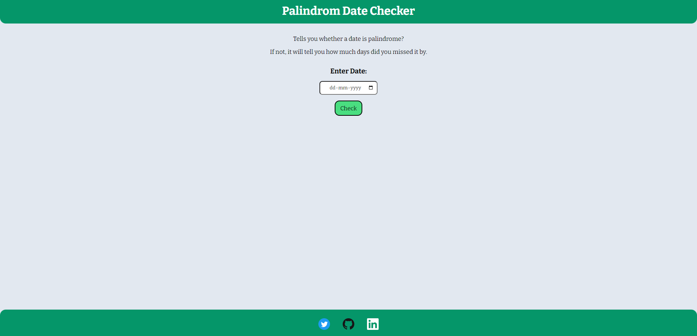

# Palindrome Date Checker

## mark-13

A web app that tells you if a date is pallindrome.

If the date is not palindorme then it tells you by how much days did you missed it. Days can be plural or singular depending on no. of days missed.

Finds both previous and after palindrome dates and tells you the one which is closer.

Made using HTML, CSS, Vanilla JS.

You can visit [here.](https://jagrut-palindromebday.netlify.app/)

